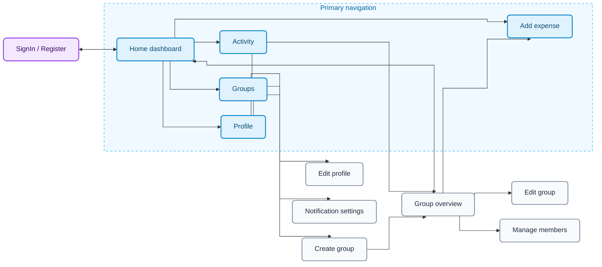

```mermaid
---
id: b7975f0d-fdc1-499e-8a5a-a3d4746ee932
---
%%{init: {'flowchart': {'curve': 'stepBefore', 'nodeSpacing': 35, 'rankSpacing': 60}}}%%
flowchart LR
    %% Styling Definitions
    classDef auth fill:#f3e8ff,stroke:#9333ea,stroke-width:2px,color:#3b0764,rx:8,ry:8
    classDef nav fill:#e0f2fe,stroke:#0284c7,stroke-width:2px,color:#0c4a6e,rx:6,ry:6
    classDef sub fill:#f8fafc,stroke:#64748b,stroke-width:1.5px,color:#1e293b,rx:6,ry:6

    Auth["SignIn / Register"]:::auth

    subgraph Navigation["Primary navigation"]
        Home["Home dashboard"]:::nav
        Groups["Groups"]:::nav
        AddExpense["Add expense"]:::nav
        Activity["Activity"]:::nav
        Profile["Profile"]:::nav

        Home --> Groups
        Home --> AddExpense
        Home --> Activity
        Home --> Profile
    end

    %% Connections (Exact same logic)
    Auth <--> Home

    Groups --> CreateGroup["Create group"]:::sub
    Groups --> GroupOverview["Group overview"]:::sub
    
    GroupOverview --> EditGroup["Edit group"]:::sub
    GroupOverview --> ManageMembers["Manage members"]:::sub
    GroupOverview --> AddExpense
    GroupOverview --> Home

    CreateGroup --> GroupOverview

    Profile --> EditProfile["Edit profile"]:::sub
    Profile --> NotificationSettings["Notification settings"]:::sub

    %% Subgraph Styling
    style Navigation fill:#f0f9ff,stroke:#7dd3fc,stroke-width:2px,stroke-dasharray: 5 5,color:#0369a1
    
```